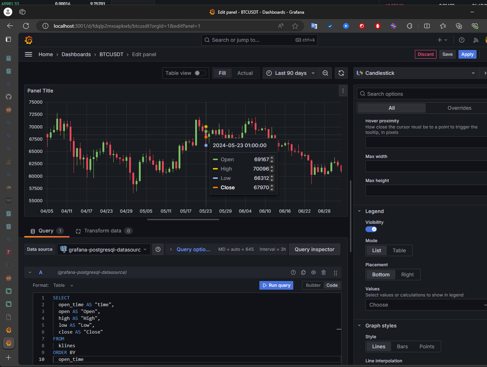

## CANDLESTICKS


1. Initial request to get snapshot of candlesticks:
	- Make a GET HTTP request to get initial snapshot of candlesticks with interval:
	- example:
	- `curl https://www.binance.com/api/v3/uiKlines?limit=1000&symbol=BTCUSDT&interval=1d`

	response:

```
[
        1633478400000, // Kline open time
        "51471.99000000", // Open price
        "55750.00000000", // High price
        "50382.41000000", // Low price
        "55315.00000000", // Close price
        "79877.54518100", // Volume
        1633564799999, // Kline close time
        "4236927265.38152227", // Quaote asset volume
        2443126, // Number of trades
        "40664.02751700", // Taker buy base asset volume
        "2158326113.66324049", // Taker buy quote asset volume
        "0" // Unused field
    ],
    [
        1633564800000,
        "55315.00000000",
        "55332.31000000",
        "53357.00000000",
        "53785.22000000",
        "54917.37766000",
        1633651199999,
        "2983143121.08864310",
        1703147,
        "26485.89849000",
        "1438826617.03898690",
        "0"
    ],...
    ]
```

	parameters:
		symbol - string
		 interval - enum (1s, 1d, etc)
		 startTime - long
		 endTime - long
		 timeZone - string
		 limit - int

	 source: Database
	 


2. Establish websocket connection to kline stream:
	 
	 example:
	`wss://stream.binance.com:9443/ws/btcusdt@kline_1d`

	  event format:
	  
```
{
  "e": "kline", // Event type
  "E": 1719880224031, // Event time
  "s": "BTCUSDT", // Symbol
  "k": {
    "t": 1719878400000, // Kline start time
    "T": 1719964799999, // Kline close time
    "s": "BTCUSDT", // Symbol
    "i": "1d", // Interval
    "f": 3657792918, //First trade ID
    "L": 3657817775, // Last trade ID
    "o": "62900.00000000", // Open price
    "c": "62987.99000000", // Close price
    "h": "62988.00000000", // High price
    "l": "62787.42000000", // Low price
    "v": "237.84815000", // Base asset volume
    "n": 24858, // Number of trades
    "x": false, // Closed or not
    "q": "14959680.90563650", // Quote asset volume
    "V": "117.47361000", // Taker buy base asset volume
    "Q": "7388850.60426130", // Taker buy quote asset volume
    "B": "0" // Ignore
  }
}
```


3. Process real-time data for klines:
	StartTime of Kline event used as an unique identifier, so if Kline Event comes with StartTime that is equal to the last Kline that is stored in snapshot, this Kline should be update with data from Kline that came as an event. Otherwise, register that Kline as a new Kline.


Binance UI box where klines are used for chart price


P.S. In my implementation of that flow I used `/api/v3/klines` as `api/v3/uiKlines` endpoint mentioned as an endpoint that is specifically adjusted to Binance UI. But the logic is the same.


## Confirmation

To confirm that my understanding of the chart price flow is correct, I decided to implement it and show my chart based on klines of `BTCUSDT` symbol that I processed. 
Then I compared my chart and a chart that is shown at Binance page.


To get klines data for `BTCUSDT` I used the same flow that I described above.

- Get an initial snapshot with limit 100 and interval as 1 day.
```
GET https://www.binance.com/api/v3/klines?limit=100&symbol=BTCUSDT&interval=1d
```

- Establish connection and read events from `kline` stream with interval 1 day

`wss://stream.binance.com:9443/ws/btcusdt@kline_1d`

- Use OpenTime as a unique identifier and add event data as a new record if OpenTime is a new, otherwise keep updating the last record.

- Every 5 seconds write data in Postgres database

- Setup Grafana Dashboard for Candlesticks and query data properly to match Candlestick template

Result:

First screenshot shows data from Binance at 2024/05/23. Interval is 1 day
Second screenshot shows data from my Grafana dashboard at 2024/05/23. Interval is 1 day as well.
The difference is only rounding, due to simplified implemenation on my side.
But data and dynamic is the same.

* First screenshot:
```
2024/05/23
Open: 69166.62
High: 70096.12
Low: 66312.16
Close: 67969.65
```

* Second screenshot:
```
2024/05/23
Open: 69167
High: 70096
Low: 66312
Close: 67970
```


