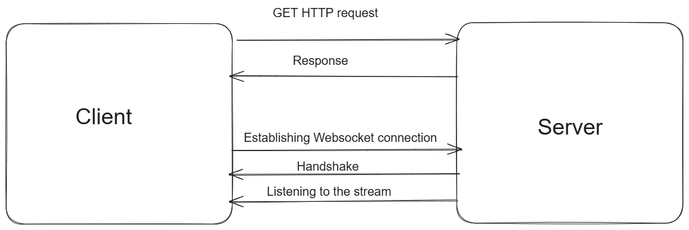

# REPORT

Main flow to get a snapshot of data and keep it updated looks like this:
We fetch data via HTTP by GET request
Connect to a websocket connection and listen to the stream to keep the data updated.
More detailed flow of each data type you can find below.

- [Order book](orderBook.md)

- [Trades](Trades.md)

- [Candlesticks](Candlesticks.md)

- [Aggregate Trades List](aggTrades.md)

