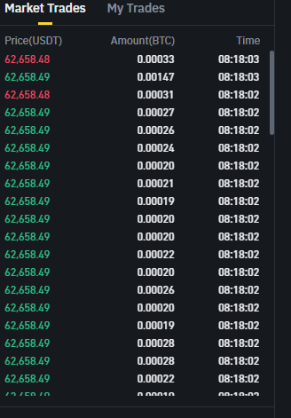

## AGGREGATE TRADE LIST

Aggregate trades is a bit different compare to normal trades. Trades that executed at the time, from the same order and with the same price will be aggregated by quantity. 

1. Initial request to get snapshot Aggregate Trades List:
	- Make HTTP GET request to get initial snapshot of Aggregate Trades List
	- example:
	- `curl https://www.binance.com/api/v1/aggTrades?limit=80&symbol=BTCUSDT`
	- response:
```
[
{
        "a": 3053003482, // Aggregate tradeId
        "p": "62900.01000000", // Price
        "q": "0.00020000", // Quantity
        "f": 3658032174, // First tradeId
        "l": 3658032174, // Last tradeId
        "T": 1719903083356, // Timestamp
        "m": true, // if the buyer waas the maker
        "M": true // if the trade was the best price match
    },
    ...
]
```

	parameters:
		symbol - string
		fromId - long - id to get aggregate trades from inclusive
		 startTime - long - timestamp in ms to aggregate from inclusive
		 endTime - long  timestamp in ms to aggregate until inclusive
		 limit - int

	 source: Database

2. Establish websocket connection to aggTrade stream:
	- example:
	- `wss://stream.binance.com:9443/ws/btcusdt@aggTrade`
	- event format:

```
{
  "e": "aggTrade", // Event type
  "E": 1719903517600, // Event time
  "s": "BTCUSDT", // Symbol
  "a": 3053008096, // Aggregate tradeId
  "p": "62869.99000000", // Price
  "q": "0.00069000", // Quantity
  "f": 3658038444, // First tradeId
  "l": 3658038444, // Last tradeId
  "T": 1719903517599, // Trade time
  "m": true, // If the buyer is the market maker
  "M": true // Ignore
}
```
 
3. Process real-time data:
 - Add a new trade to the aggregated traded list.
 - if the trade list has limits remove oldest trades and keep the size of the list within limits


Binance UI box where this data is used:

