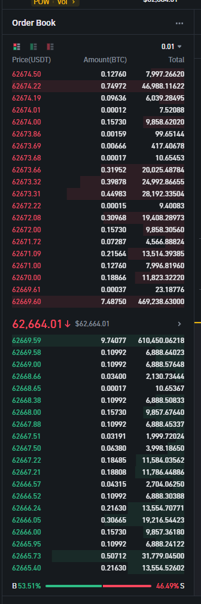

1. Establish a websocket connection to depth stream
	- `wss://stream.binance.com:9443/ws/btcusdt@depth`

```
{ E: 1719866741046,
U: 48360895122,
a: [ ["63335.45000000", "8.99750000"], ["63340.47000000", "0.00000000"] ],
b: [["63335.44000000", "14.98702000"], ["63334.76000000", "0.00000000"]  // [price, quantity] ],
e: "depthUpdate",  
s: "BTCUSDT",  
u: 48360895203}
```

2. Initial request to get Order book snapshot:
	- Make a GET HTTP request to Binance API to get the initial order book snapshot.
	example:
		`curl  https://www.binance.com/api/v3/depth?symbol=BTCUSDT&limit=1000`
	 response:
```
{ "lastUpdateId": 1027024, 
	"bids": [ ["63360.00000000","0.46583000"] // [price, quantity] ], 
	"asks": [ [ "63360.01000000","16.46063000"] 
	] }
```

	parameters:
		symbol - string
		 limit - int
	source: Memory

- save `lastUpdateId` for future updates


3. Process real-time data for order book:
	- Any event where `u` is less or equal to `lastUpdateId` that was saved should be dropped.
	- The first processed even should satisfy this condition  `U <= lastUpdateId + 1 && u >= lastUpdate`
	- Each new event that we keep getting during this stream should satisfy this condition `U = lastUpdateId + 1`
	- if `quantity` of the price level is equal to `"0.00000000"`, then this price level should be removed


Binance UI box where Order book's data is used:

